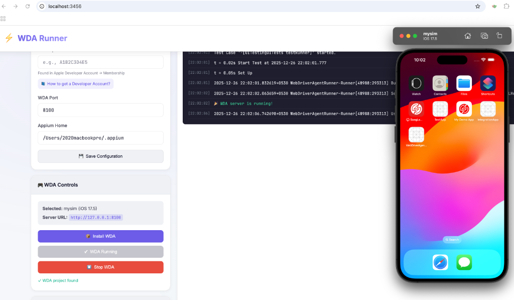

# ⚡ WDA Runner

A modern web interface utility to install and start WebDriverAgent (WDA) on iOS physical devices and simulators.


## 🎯 Features

- **📱 Device Detection** - Auto-detect connected iOS physical devices and simulators
- **🔐 Signing Configuration** - Easy input for Apple Developer credentials
- **🎮 WDA Controls** - One-click Install, Start, Stop buttons
- **📋 Live Logs** - Real-time streaming of xcodebuild and iproxy logs
- **📘 Developer Guide** - Built-in guide on how to get Apple Developer account
- **🎨 Modern UI** - Clean, responsive light theme interface

## 📸 Screenshot



## 📋 Prerequisites

Before using WDA Runner, ensure you have the following installed:

- **macOS** (required for iOS development)
- **Xcode** (with Command Line Tools)
- **Node.js** (v16 or higher)
- **Appium** with XCUITest driver

### Optional (for physical devices)
- **libimobiledevice** - for device detection
- **iproxy** - for USB port forwarding

```bash
# Install libimobiledevice (macOS)
brew install libimobiledevice

# Install iproxy
npm install -g iproxy
```

## 🚀 Quick Start

### 1. Clone or Download

```bash
git clone https://github.com/yourusername/wda-runner.git
cd wda-runner
```

### 2. Install Dependencies

```bash
npm install
```

### 3. Start the Server

```bash
npm start
```

### 4. Open in Browser

Navigate to [http://localhost:3456](http://localhost:3456)

## 📖 Usage

### For Simulators (No Apple ID Required)

1. Select the **Simulators** tab
2. Choose a simulator from the list
3. Click **Install WDA** (first time) or **Start WDA**
4. Watch the logs for progress
5. WDA will be available at `http://127.0.0.1:8100`

### For Physical Devices (Apple ID Required)

1. Connect your iOS device via USB
2. Select the **Physical Devices** tab
3. Enter your **Development Team ID** in the configuration
4. Click **Install WDA** to build and install
5. Trust the developer certificate on your device:
   - Go to **Settings → General → VPN & Device Management**
   - Find your developer profile and tap **Trust**
6. Click **Start WDA**

## 🔐 Getting a Development Team ID

WDA Runner includes a comprehensive guide on how to obtain an Apple Developer account.

**Click the link below the Development Team ID field** or visit:
```
http://localhost:3456/developer-guide.html
```

Key points:
- **Simulators**: No developer account needed
- **Free Apple ID**: Works for testing (apps expire every 7 days)
- **Paid Developer Program**: $99/year for extended capabilities

## 🛠️ API Endpoints

| Endpoint | Method | Description |
|----------|--------|-------------|
| `/api/devices` | GET | List connected physical devices |
| `/api/simulators` | GET | List available iOS simulators |
| `/api/wda/check` | GET | Check if WDA project exists |
| `/api/wda/install` | POST | Build and install WDA |
| `/api/wda/start` | POST | Start WDA server |
| `/api/wda/stop` | POST | Stop WDA processes |
| `/api/wda/status` | GET | Check WDA running status |
| `/api/config` | GET | Get current configuration |
| `/api/config/save` | POST | Save configuration |
| `/api/appium/install-driver` | POST | Install/update XCUITest driver |

## 📁 Project Structure

```
wda-runner/
├── package.json          # Node.js dependencies
├── server.js             # Express backend with WebSocket
├── wda-config.json       # Saved configuration (auto-generated)
├── public/
│   ├── index.html        # Main web interface
│   ├── styles.css        # Light theme styling
│   ├── app.js            # Frontend JavaScript
│   └── developer-guide.html  # Apple Developer guide
└── README.md
```

## 🔧 Configuration Options

| Option | Description | Default |
|--------|-------------|---------|
| Development Team ID | Your Apple Developer Team ID | - |
| WDA Port | Port for WDA server | 8100 |
| Appium Home | Path to Appium installation | ~/.appium |

## 🐛 Troubleshooting

### "WDA project not found"
Install the XCUITest driver:
```bash
appium driver install xcuitest
```
Or use the **Install/Update XCUITest Driver** button in the UI.

### "Could not find any iOS devices"
- For simulators: Ensure Xcode is installed
- For physical devices: Install libimobiledevice (`brew install libimobiledevice`)

### "Code signing error"
- Ensure you've entered the correct Development Team ID
- Open the WDA project in Xcode and configure signing manually
- Trust the developer certificate on your device

### "WDA fails to start"
- Make sure no other WDA instance is running
- Try stopping and starting again
- Check the logs for specific errors

## 📝 License

MIT License - feel free to use this project for any purpose.

## 🤝 Contributing

Contributions are welcome! Please feel free to submit a Pull Request.

## 📚 Related Resources

- [Appium XCUITest Driver](https://github.com/appium/appium-xcuitest-driver)
- [WebDriverAgent](https://github.com/appium/WebDriverAgent)
- [Apple Developer Program](https://developer.apple.com/programs/)
